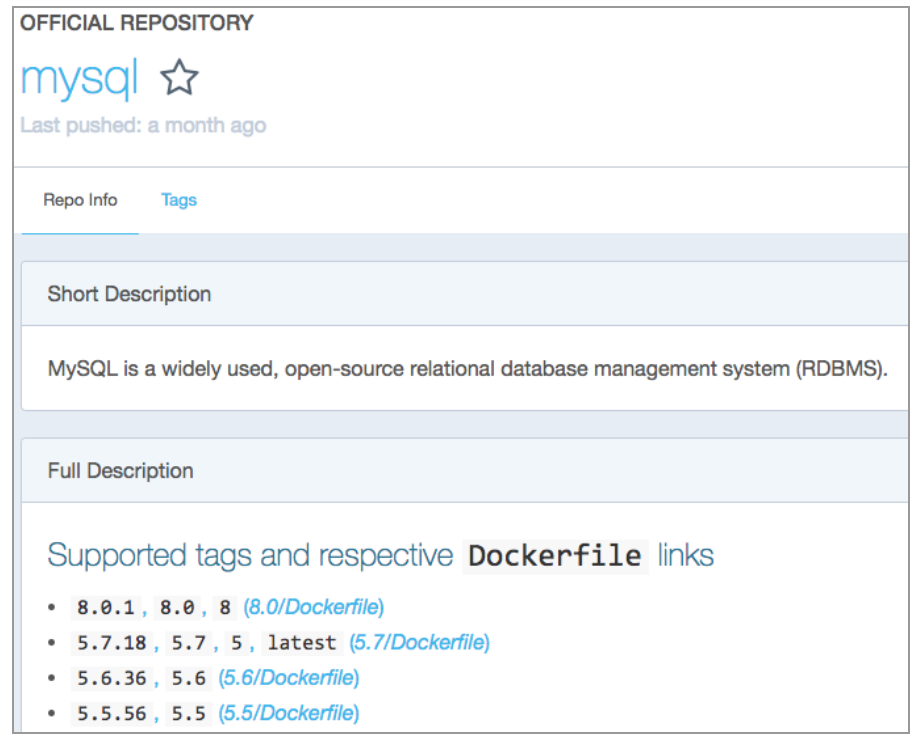

To release ISLE code and updates, a public open [Github](https://github.com/) repository linked to [Docker Hub](https://hub.docker.com/), a cloud-based registry service will be used.

Docker Hub will provide the centralized resource for ISLE container image discovery and distribution for end-users, automated testing and deploy services to build, test and download images.

Users of ISLE will download “tagged” versions of the software (images) to see what version fits their current needs; either a “legacy” setup to provide a clear “upgration” path or a fully current, tested and stable version for production use.

* Example of a “tagged” software version on Docker Hub:

By using tagged releases (images) for container software e.g. SOLR versions 4.2 - 4.10, end-users will be able to spin up containers quickly and test a wider variety of configurations with the ultimate goal of being on the most recent and stable version. End-users will also be able to make quick edits to configuration templates from the downloaded Github repositories to establish the basic three environment types;

* remote admin (sandbox)
* staging
* production.

For specific tags by version please reference, the Supported Specification Matrix [table](supported-specification-matrix-table.md)

Additional platform customization and configuration will be handled by the creation of master Dockerfiles template whose values end-users can change for the appropriate institution specific values e.g. edits to schema.xml, config.xml, XSLTs, xacml permissions etc
